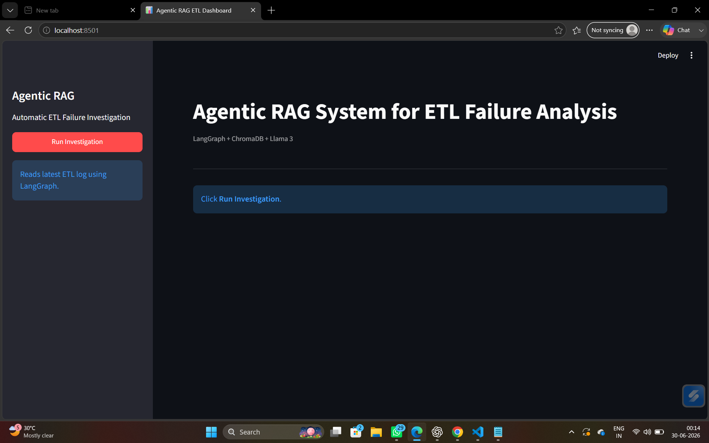
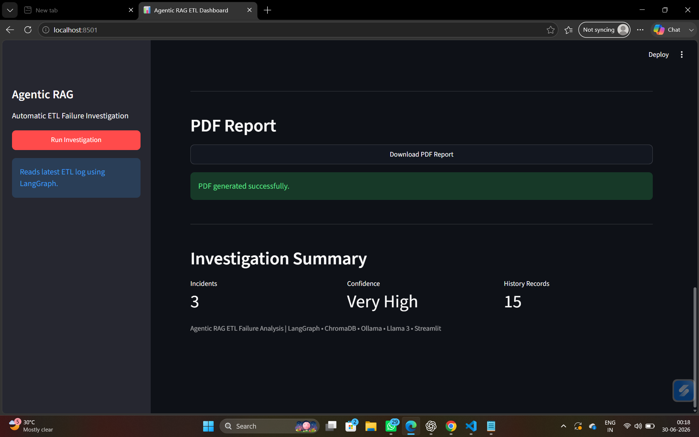
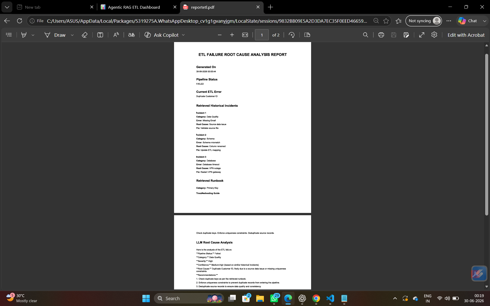

# Agentic RAG System for ETL Failure Analysis and Root Cause Investigation

An AI-powered ETL failure investigation system that automatically detects ETL failures, retrieves similar historical incidents and troubleshooting runbooks using Retrieval-Augmented Generation (RAG), generates Root Cause Analysis (RCA) with Llama 3, and produces downloadable PDF reports through an interactive Streamlit dashboard.

---

# Features

- Automated ETL Pipeline Execution
- Data Validation
- SQLite Incident Database
- Semantic Search using ChromaDB
- Historical Incident Retrieval
- Runbook Retrieval
- LangGraph Agent Workflow
- Llama 3 Root Cause Analysis
- PDF Report Generation
- Interactive Streamlit Dashboard

---

# Project Architecture

```
                Customers.csv
                      │
                      ▼
               ETL Pipeline
                      │
                      ▼
              Data Validation
                      │
         ┌────────────┴────────────┐
         ▼                         ▼
 SQLite Incident DB         Pipeline Logs
         │                         │
         └────────────┬────────────┘
                      ▼
                 LangGraph Agent
                      │
        ┌─────────────┼─────────────┐
        ▼             ▼             ▼
 Read Error    Retrieve Incidents   Retrieve Runbook
        │             │             │
        └─────────────┴─────────────┘
                      ▼
             Retrieve History
                      ▼
              Prompt Builder
                      ▼
                  Llama 3
                      ▼
          Root Cause Analysis
                      ▼
             PDF Report Generator
                      ▼
             Streamlit Dashboard
```

---

# Folder Structure

```
agent/
    graph.py
    nodes.py
    state.py
    tools.py

classifier/

dashboard/
    dashboard.py

data/

database/

db/
    database.py

etl/

llm/
    analyser.py
    ollama_client.py
    prompt_builder.py

logs/

parser/

rag/

reports/
    pdf_report.py

main.py
requirements.txt
README.md
```

---

# Technologies Used

## Programming Language

- Python

## AI / Machine Learning

- Llama 3 (Ollama)
- Sentence Transformers
- all-MiniLM-L6-v2

## Agent Framework

- LangGraph

## Vector Database

- ChromaDB

## Database

- SQLite

## Dashboard

- Streamlit

## Reporting

- ReportLab

---

# Installation

Clone the repository

```bash
git clone https://github.com/komal-1723/agentic-rag-etl-failure-analysis.git
```

Move into the project

```bash
cd agentic-rag-etl-failure-analysis
```

Create a virtual environment

```bash
python -m venv .venv
```

Activate it

Windows

```bash
.venv\Scripts\activate
```

Install dependencies

```bash
pip install -r requirements.txt
```

Install Llama 3

```bash
ollama pull llama3
```

Start Ollama

```bash
ollama serve
```

---

# Running the Project

Run the complete ETL investigation

```bash
python main.py
```

Run the dashboard

```bash
streamlit run dashboard/dashboard.py
```

---

# Workflow

1. Execute ETL Pipeline
2. Detect ETL Failures
3. Store Incidents in SQLite
4. Retrieve Similar Historical Incidents
5. Retrieve Troubleshooting Runbook
6. LangGraph Orchestrates Investigation
7. Generate Root Cause Analysis using Llama 3
8. Generate PDF Report
9. Display Results in Streamlit Dashboard

---

# Sample Output

The system provides:

- Current ETL Error
- Historical Similar Incidents
- Retrieved Runbook
- Root Cause Analysis
- Recommendations
- Confidence Score
- Downloadable PDF Report

---

# Screenshots


- Dashboard Home
  
  
- Investigation Results
  

- Generated PDF Report
  


---

# Future Improvements

- REST API Integration
- Slack / Microsoft Teams Notifications
- Automated Email Reports
- Docker Deployment
- CI/CD using GitHub Actions
- Unit Testing
- Cloud Deployment

---

# Author

Komal K

B.Tech Computer Science Engineering

SASTRA Deemed University

GitHub

https://github.com/komal-1723

---

# License

This project is developed for educational and portfolio purposes.